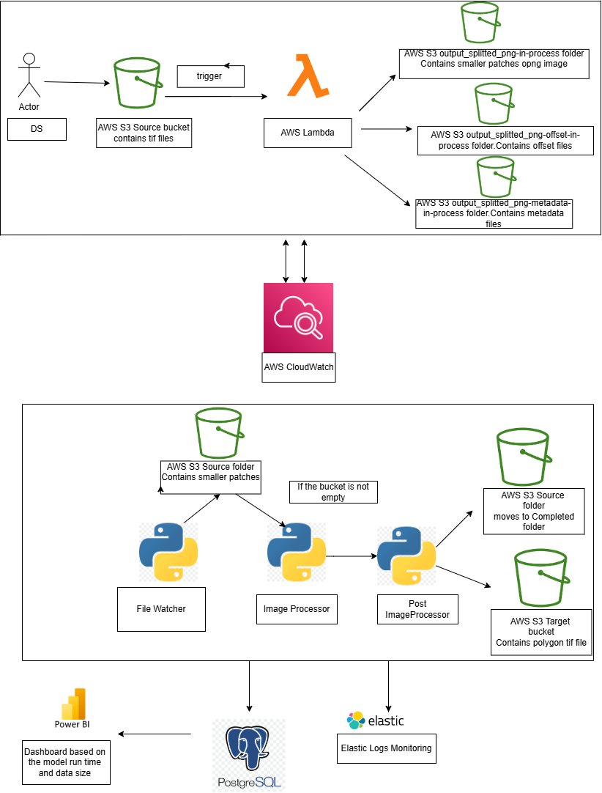
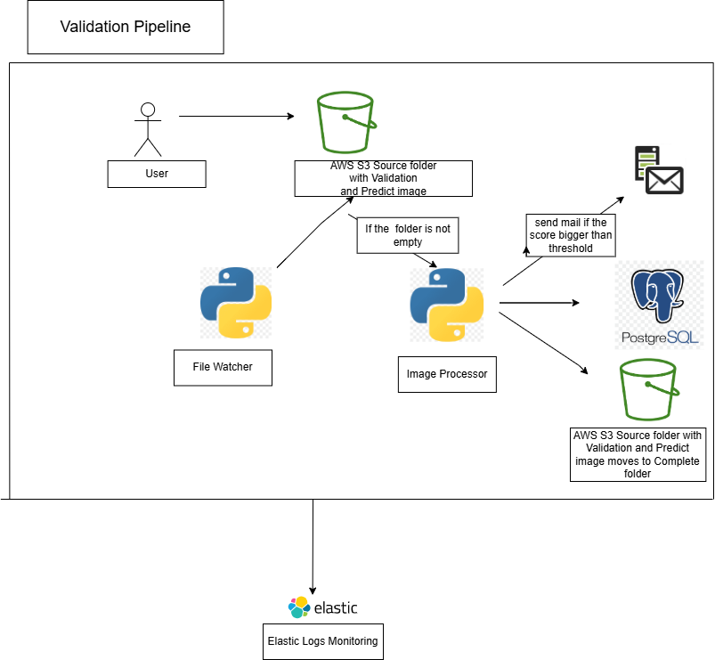

Company Name: GreenSight Mapping Solutions

Backstory: GreenSight Mapping Solutions is a startup company founded in 2022 by a team of passionate geospatial data scientists and machine learning experts. The company's mission is to revolutionize the way maps are created and analyzed by leveraging cutting-edge technology and innovative approaches.

The founders recognized a significant challenge in the mapping industry: the time-consuming and labor-intensive process of manually identifying and mapping trees from aerial imagery. They saw an opportunity to automate this process using machine learning algorithms, which would not only save time and resources but also provide more accurate and up-to-date information about tree coverage.ה

As a startup, GreenSight Mapping Solutions is working under tight deadlines and limited resources. They have recently started exploring Amazon Web Services (AWS) as a potential platform to deploy their solution, but they are still unsure about the best approach to take.

The company's main objective is to develop a prototype of their tree detection system within a month. They have a dataset of .tif files, which are high-resolution aerial images of various landscapes. The goal is to create a machine learning model that can automatically detect and map trees from these images.

GreenSight Mapping Solutions believes that their automated tree detection system will have a significant impact on various industries, such as urban planning, environmental conservation, and forestry management. By providing accurate and timely information about tree coverage, they can help organizations make better decisions and take action to protect and preserve green spaces.


Technical: 
Machine Learning Model: The tree detection model is based on the Detectree model (https://github.com/martibosch/detectree), which is a state-of-the-art deep learning model specifically designed for tree detection in aerial imagery. The Detectree model utilizes a convolutional neural network (CNN) architecture to identify and locate trees in the input images.

the Model pkl file is: “tree_model_new” is use by the next code:

    clf = pickle.load(open('tree_model_new', 'rb'))
    clf_model = dtr.Classifier(clf=clf)


and predict by:

clf_model.predict_img(f'{OUTPUT_PNG_SPLIT}/{png_name}')


The implementation of this project is based on 3 pipelines:





This project contains 2 pipelines:
Processing pipeline and validation pipeline.
Lambda pipeline is located in different git project (https://github.com/miriezrubelsky/green-lambda)

# <span style="color: blue;">**Processing Pipeline Overview**</span>

This project processes remote sensing images (TIFF and PNG) and uploads the results to an S3 bucket, 
while also logging relevant data to a PostgreSQL database and ES. 
The primary operations include downloading files from S3, processing images, saving results,updating the database and saving logs to ES.

# <span style="color: blue;">**Key Components:**</span>

# <sub>File Management:</sub>


Downloads necessary files from an S3 bucket using s3_file_handler.
Uploads processed files back to S3.
Moves completed folders to a designated "completed" directory on S3.

# <sub>Data Loading:</sub>


Loads necessary metadata, offsets, and TIFF files from local storage using local_file_handler.


# <sub>Image Processing:</sub>

Processes TIFF files and associated PNG images.
Uses ImageProcessor to adjust polygons in the images based on metadata and offsets.
Post-processes and saves the output as shapefiles using PostImageProcessor.

# <sub>Database Interaction:</sub>


Logs information about each processing run to a PostgreSQL database using DBHandler.
Logs include start and end times, total data size, and run duration.

# <sub>Mail Interaction:</sub>

MailHandler is a utility class for sending emails via SMTP, 
providing an easy interface for email communication with configurable server and authentication details.

# <sub>ES Logging:</sub>

The application uses AppLogger to log debug information to ES throughout the workflow, helping to trace the processing steps.


# <sub>Run Logic:</sub>

The process is initiated in the `main()` function, which performs the following steps:<br>
- Checks if the input S3 folder is empty.<br>
- Downloads files from S3.<br>
- Processes each TIFF file and its associated PNG images.<br>
- Logs the results of each run into the database.<br>
- Uploads processed files to S3 and moves all "in-process" files to the "completed" folder.


# <span style="color: blue;">**Project Workflow:**</span>

- Download Files: Retrieves necessary input data (files) from an S3 bucket.<br>
- Process TIFF & PNG Images: For each TIFF file, it processes corresponding PNG images by adjusting polygons based on metadata and offsets.<br>
- Post-processing: Saves the processed results as shapefiles.<br>
- Database Logging: Logs the processing details (timing, size, output) into a PostgreSQL database.<br>
- Upload and Completion: Uploads processed files back to S3 and moves them to a "completed" folder.

ES Logging: All Debug logs are to logs to ES and can be viewed through kibana<br>


# <span style="color: blue;">**Validation Pipeline Overview**</span>

This project is focused on the validation of image processing models using a combination of image comparison, 
database updates, and email notifications. The key functionalities are outlined below:

# <span style="color: blue;">**Validation Workflow:**</span>
The validate() function handles the validation process by:
-Download validation and processing images from S3. <br>
-Connecting to a database (DBHandler).<br>
-Categorizing files into validation and prediction images.<br>
-Processing the prediction image and calculating the Jaccard similarity score between the predicted and validation images using validation_utils.<br>
-Sending the validation results via email and updating the database with the calculated score, comparison status, and error messages.<br>

ES Logging: All Debug logs are to logs to ES and can be viewed through kibana<br>


# Project Directory Structure
 ``` greenproject
│     ├─ appLogger.py
│     ├─ config
│     │  ├─ config.py
│     │  ├─ db_config.py
│     ├─ db_handler
│     │  ├─ db_handler.py
│     ├─ elastic
│     │  ├─ docker-compose.yaml
│     │  ├─ es_docker_mbeat_03.Dockerfile
│     │  ├─ kibana.yml
│     │  ├─ metricbeat.yml
│     │  └─ startup_metricbeat.sh
│     ├─ file_handler
│     │  ├─ local_file_handler.py
│     │  ├─ s3_file_handler.py
│     ├─ green_project_file_watcher.py
│     ├─ input-data
│     │  ├─ trueOrtho_20cm_2.tif
│     │  ├─ trueOrtho_20cm_3.tif
│     │  ├─ trueOrtho_20cm_4.tif
│     │  ├─ trueOrtho_20cm_5.tif
│     │  └─ __init__.py
│     ├─ mail_handler
│     │  ├─ mail_handler.py
│     │  └─ __init__.py
│     ├─ main.py
│     ├─ processing
│     │  ├─ image_processor.py
│     │  ├─ post_image_processor.py
│     │  └─ __init__.py
│     ├─ requirements.txt
│     ├─ trained_model
│     │  ├─ tree_model_new
│     ├─ validator.py
│     ├─ validator_file_watcher.py ```


```

